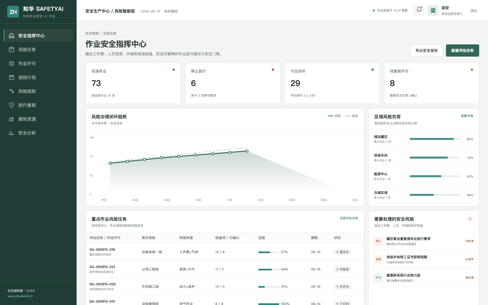
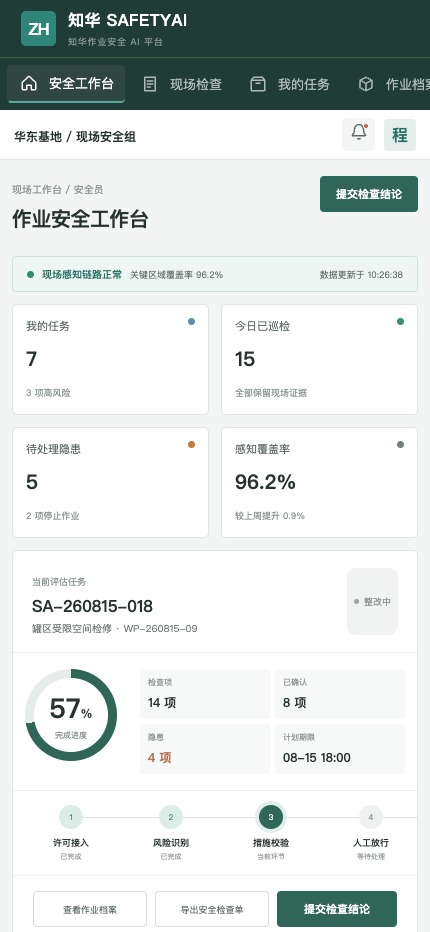

# ZhuaTech SafetyAI

## 知华作业安全 AI 社区版

**先识别风险，再由责任人决定是否放行。**

SafetyAI 由[知华科技（上海如静知华信息科技有限公司）](https://www.zhuatech.cn/)开发并发布。它是一套面向危险作业评估与现场安全协同的前后端分离示例，适用于个人学习 HSE 数字化、Java 企业应用和可解释 AI 工程。



### 指挥中心

- 在场作业、停止放行、今日闭环和待复核许可实时汇总
- 区域风险负荷、重点作业任务和隐患处置集中展示
- 作业票、人员资质、环境、气体检测与现场视频统一留证



### 现场工作台

- 安全员查看当日任务、风险来源、必需控制措施和审批状态
- 支持现场检查反馈、作业档案、感知状态与隐患升级
- 适配 430px 移动视口，管理端和 H5 共享同一领域配置

## 风险计算示例

`POST /api/ai/safety/assess` 根据危害数量、高风险作业数、人员数量、天气等级、培训覆盖率和防护合规率输出：

- `CONTROLLED / WATCH / CRITICAL` 风险等级
- `PASS / REVIEW / STOP` 放行建议
- 分值、处置说明与逐项控制措施

社区算法完全本地运行，不需要任何外部 API Key。AI 结果不替代企业安全制度、法定检查和有权限人员审批。

## 技术底座

```text
Vue 3 + Pinia + Vue Router + Vite
Java 21 + Spring Boot + JWT + JPA + Bean Validation
MySQL 8 + Flyway（测试环境 H2）
Docker Compose + Nginx
```

Java 根包：`cn.zhuatech.safetyai`。接口说明见 [docs/api.md](docs/api.md)，数据结构见 [docs/database.md](docs/database.md)。

## 本地启动

```bash
cd frontend
npm install
npm run dev:demo
```

访问 `http://localhost:5173`；管理端 `planner / Demo@2026`，现场端 `operator / Demo@2026`。所有作业、人员和事故风险数据均为虚构演示内容。

## 许可边界与联系

本工程仅可用于个人、非商业性的学习、研究和技术交流，**不得商用**。任何企业内部使用、生产部署、SaaS、收费交付、品牌替换、集成销售或二次销售，都需要上海如静知华信息科技有限公司事先书面授权；详见 [LICENSE](LICENSE)。

需要 HSE 系统实施、视频/物联接入、OPC 技术支持或深度定制，可访问[知华科技官网](https://www.zhuatech.cn/)并扫码联系：

| 安全数字化咨询 | 商业授权 / 定制开发 |
| --- | --- |
|  |  |

版权所有 © 2026 上海如静知华信息科技有限公司。

SEO：作业安全 AI、HSE 系统、危险作业风险评估、电子作业票、安全生产管理、Java HSE 源码、知华科技。
